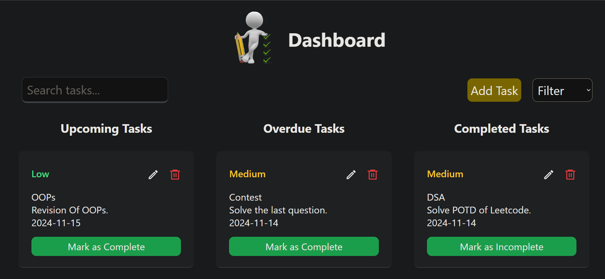
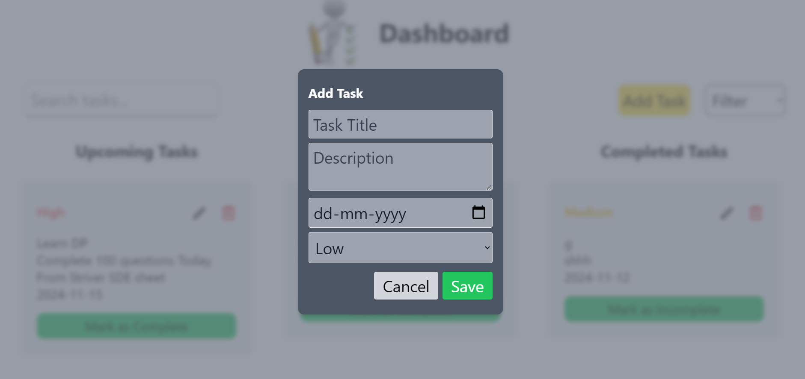
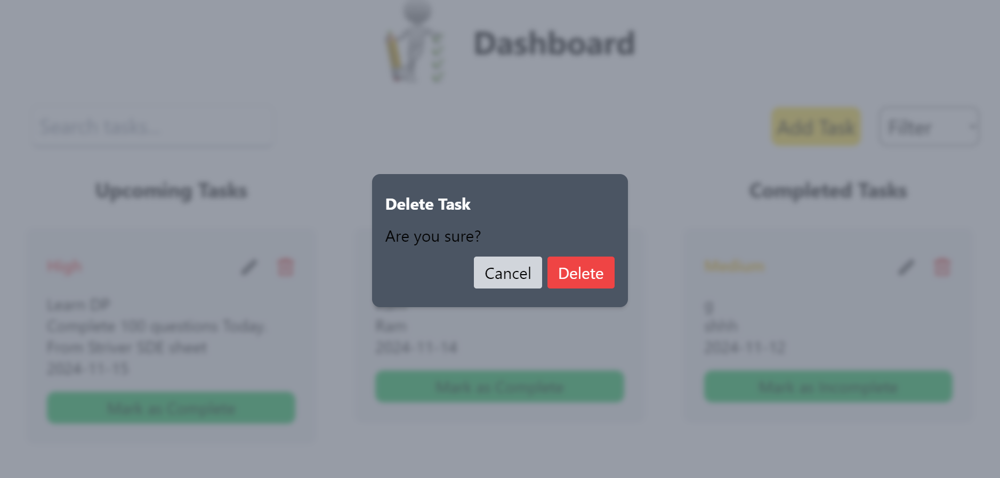

---
# Simple Task Manager

## Run the project using "npm start" command
## [Live link](https://simple-task-manager.vercel.app/)


## Project Overview

The **Simple Task Manager** is a web application that allows users to create, view, edit, and delete tasks. Each task has key attributes like **title**, **description**, **due date**, and **priority**. The dashboard also offers features for searching, filtering, and sorting tasks based on criteria such as **priority** and **status** (completed or overdue).

## DashBoard
  

## Project Goals

- **Dashboard**: Display all tasks in a main dashboard view, with sections for **upcoming**, **overdue**, and **completed** tasks.
- **CRUD Operations**: Provide functionality to **create**, **read**, **update**, and **delete** tasks.
- **Search & Filter**: Allow users to search and filter tasks by keywords, priority level, or completion status.
- **UI & Responsiveness**: Design a mobile-responsive interface using **Tailwind CSS** to ensure a user-friendly experience across devices.
- **Storage**: Store tasks using the browser's **localStorage** for data persistence without requiring a backend.

## Prerequisites

- Basic knowledge of **JavaScript** and **React**.
- Familiarity with **Tailwind CSS** (for styling).
- Basic understanding of **localStorage**.

## Step 1: Project Setup

### 1.1 Initialize the Project

Create a new React application by running the following commands:

```bash
npx create-react-app task-dashboard
cd task-dashboard
```

### 1.2 Install Tailwind CSS

Install Tailwind CSS and configure it in your React project:

```bash
npm install -D tailwindcss
npx tailwindcss init
```

Next, configure Tailwind CSS by adding the following paths to the `content` array in your `tailwind.config.js` file:

```js
module.exports = {
  content: [
    "./src/**/*.{js,jsx,ts,tsx}",
  ],
  theme: {
    extend: {
      colors: {
        'regal-blue': '#243c5a',
        'High': '#e74c3c',
        'Low' : '#f4d03f',
        'Medium' : '#e74c3c'
      }
    },
  },
  plugins: [],
}
```

In the `src/index.css` file, import Tailwind CSS:

```css
@tailwind base;
@tailwind components;
@tailwind utilities;
```

### 1.3 Install React Icons

Install the **react-icons** library to easily add icons to your application:

```bash
npm install react-icons
```

## Step 2: Task Management Features

Once the project is set up, you can start building out the core functionality for the task management system, which includes:

- **Creating and editing tasks**: Use React state and forms to collect task details like title, description, due date, and priority.
- **Displaying tasks**: Use Tailwind's grid and flex utilities to create a clean, responsive task list with sections for upcoming, overdue, and completed tasks.
- **Task filtering and searching**: Implement search and filter functionality for sorting tasks by keywords, priority, or completion status.
- **Data persistence**: Use the browser’s `localStorage` to store tasks and maintain data between sessions.

## Add Task
 

## Edit Task
  

## DeleteTask
  


## Step 3: UI & Responsiveness

Use **Tailwind CSS** to style your application. Tailwind’s utility-first approach allows you to quickly build a modern, responsive UI. You can add classes such as `flex`, `grid`, `w-full`, and `sm:w-1/2` to achieve a responsive layout.
